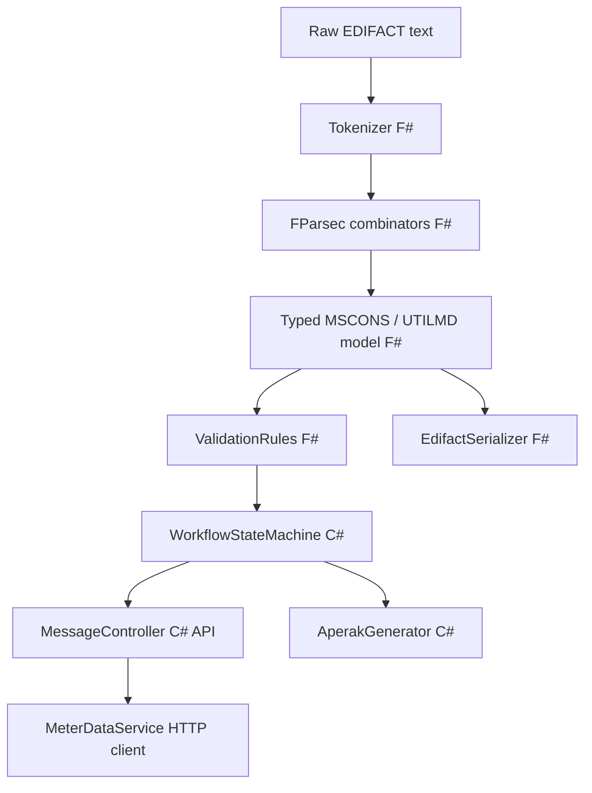

# edifact-energy-parser

> F# parser for EDIFACT energy messages (MSCONS, UTILMD) with a C# ASP.NET Core workflow API.


---

## Problem

Market communication in the German energy market is governed by EDIFACT-based message formats defined by the BDEW. Every supplier switch (Lieferantenwechsel), meter reading submission (MSCONS), and master data exchange (UTILMD) travels as a structured EDIFACT text file. Parsing these files correctly requires handling escape characters, optional segments, conditional group structures, and strict validation against the applicable application handbook (Anwendungshandbuch).

This project implements a typed EDIFACT parser in F# — chosen for its pattern-matching strength and discriminated unions that map naturally to segment alternatives — with a C# workflow layer that processes incoming messages through a state machine and generates APERAK-style acknowledgements.

---

## Features

- F# EDIFACT tokenizer: UNA service string advice, UNB/UNH envelope, segments, composite elements, escape characters
- Parser combinators with FParsec for typed MSCONS (meter readings) and UTILMD (supplier switch / master data) models
- Validation rules as composable F# functions returning `Result<'T, ValidationError list>`
- Round-trip guarantee: parse → model → serialize → parse produces identical models (FsCheck property tests)
- C# ASP.NET Core API: receive → validate → state machine (Received → Validated → Processed/Rejected) → APERAK-style response
- "Message explainer" endpoint: raw EDIFACT → human-readable JSON description of every segment
- MSCONS import feeding `meter-data-service` (cross-project integration)

---

## Innovation

_TODO: expand after implementation_

---

## Architecture



---

## Quick Start

```bash
dotnet run --project src/EdifactEnergyParser.Api
```

Parse a MSCONS message:

```bash
curl -X POST http://localhost:5001/api/messages \
  -H "Content-Type: text/plain" \
  --data-binary @docs/samples/mscons_example.edi
```

Explain a message:

```bash
curl -X POST http://localhost:5001/api/messages/explain \
  -H "Content-Type: text/plain" \
  --data-binary @docs/samples/mscons_example.edi
```

---

## Domain Glossary

| German | English | Explanation |
|--------|---------|-------------|
| MSCONS | MSCONS | Meter reading results message; used to submit interval meter data |
| UTILMD | UTILMD | Utility master data message; used for supplier switch and contract data |
| APERAK | APERAK | Application error and acknowledgement message |
| GPKE | GPKE | Geschäftsprozesse zur Kundenbelieferung mit Elektrizität — regulatory process handbook |
| GeLi Gas | GeLi Gas | Geschäftsprozesse Lieferantenwechsel Gas — same for gas |
| Anwendungshandbuch | Application handbook | BDEW specification for a specific EDIFACT message type |
| Lieferantenwechsel | Supplier switch | Process by which a customer changes their energy supplier |

---

## Testing

```bash
dotnet test
```

Coverage highlights:
- Round-trip property tests (FsCheck): 10 000+ generated messages satisfy parse → serialize → parse identity
- Escape character edge cases in segment data
- All validation error paths return structured `ValidationError` with segment reference
- State machine: all valid and invalid transitions covered

---

## Design Decisions

See `docs/adr/` for Architecture Decision Records.

---

## Roadmap / Next Steps

- Full UTILMD supplier-switch workflow
- CONTRL acknowledgement (syntax-level)
- Performance: parse 1 MB MSCONS in < 100 ms

---

## Kurzfassung auf Deutsch

Dieses Projekt implementiert einen vollständigen EDIFACT-Parser in F# für die im deutschen Energiemarkt verwendeten Nachrichtenformate MSCONS und UTILMD. Der Tokenizer verarbeitet die UNA-Zeichenkette, alle Segmentgruppen sowie Sonderzeichen gemäß den BDEW-Spezifikationen. Mit FParsec-Kombinatoren werden typisierte F#-Modelle erzeugt, die durch komponierbare Validierungsregeln geprüft werden. Eine Round-Trip-Garantie wird durch FsCheck-Eigenschaftstests sichergestellt. Der C#-Workflow-Layer nimmt Nachrichten über eine ASP.NET Core API entgegen, führt sie durch eine Zustandsmaschine und erzeugt APERAK-ähnliche Antworten. Ein „Message Explainer"-Endpunkt übersetzt rohe EDIFACT-Nachrichten in menschenlesbare JSON-Beschreibungen.
